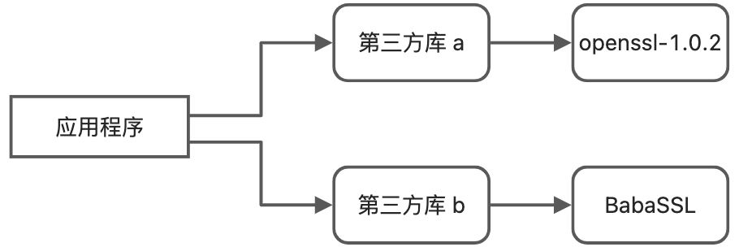
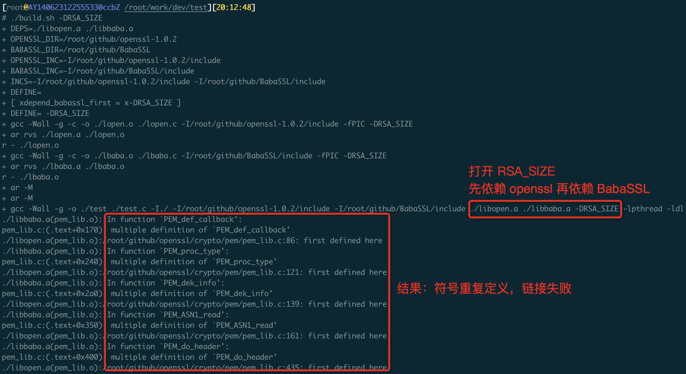
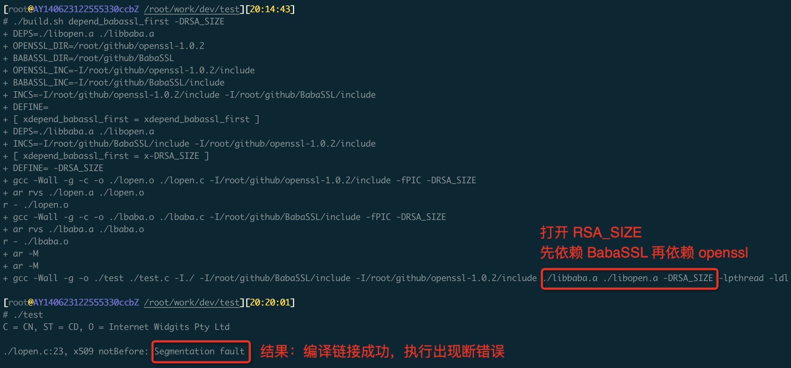
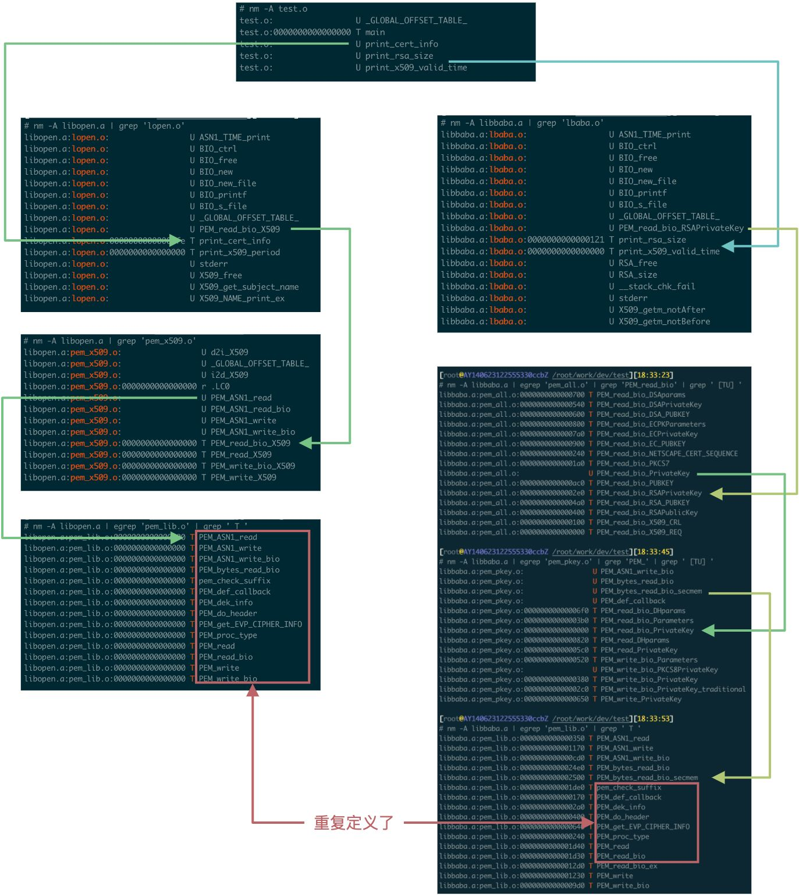
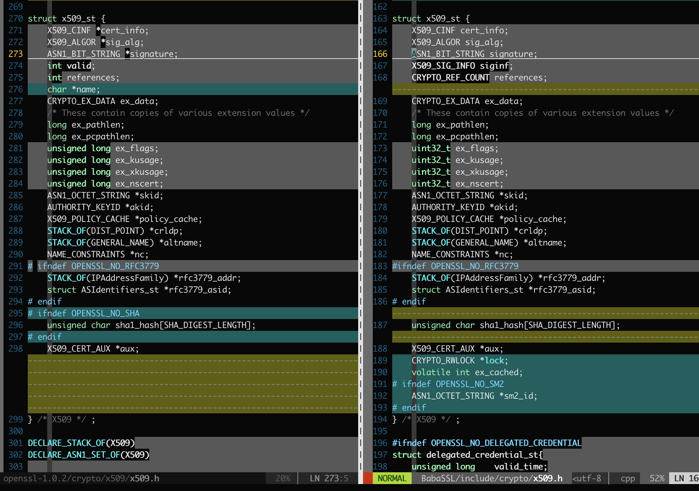
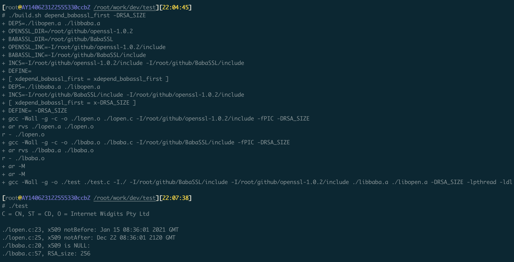
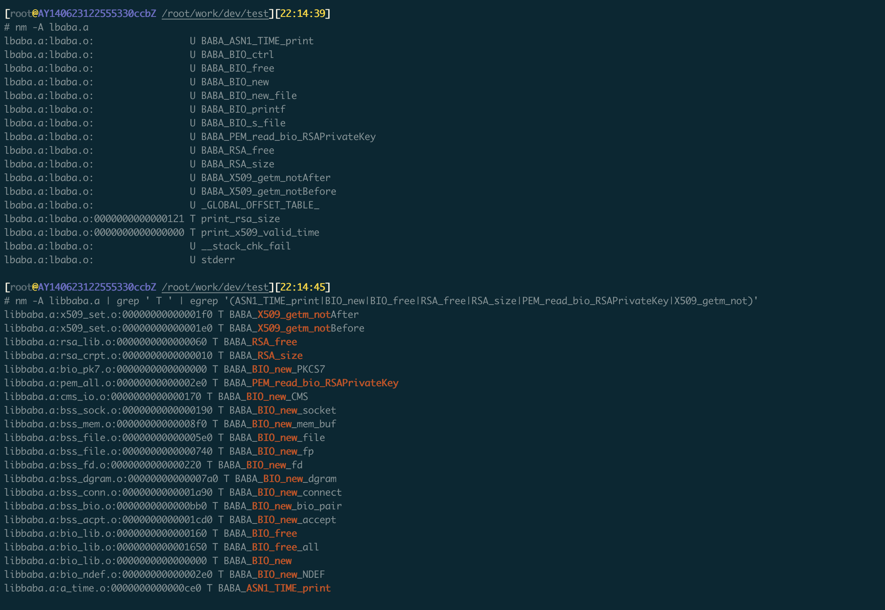
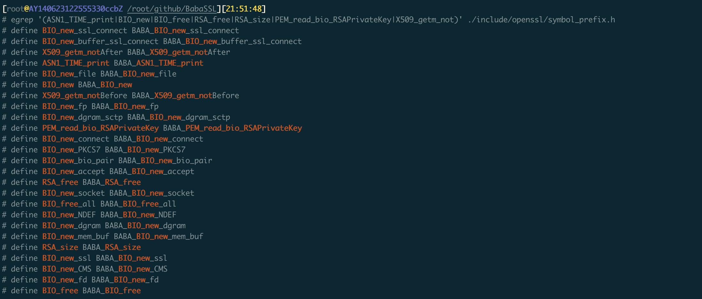
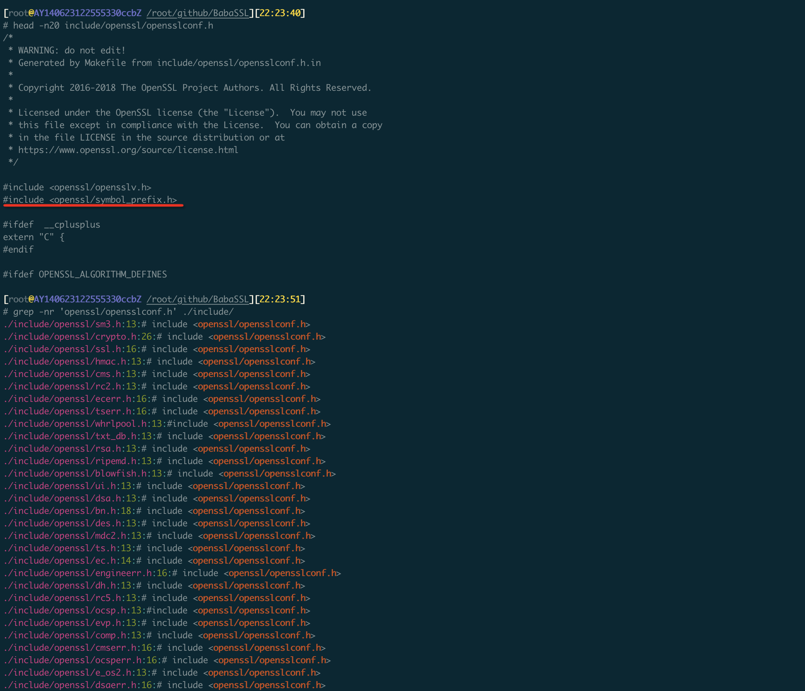

# 与其他 OpenSSL 版本库共存方案
## 背景
随着《密码法》颁布和实施以来，商密算法（SM）和国密握手协议（TLCP）越来越重要，各银行、金融和安全企业纷纷对自己的软件进行改造，以应对监管的检查，一些大型软件或者客户端依赖了很多第三方库，第三方库可能依赖了 openssl，并以静态库的方式打包到一个 SDK 中，然后再提供给客户端软件使用，这时候引入 BabaSSL 进行国密改造的话，会面临 BabaSSL 与其他 openssl 同时依赖而导致的一些问题，比如：编译时可能的符号冲突问题、链接时符号可能绑定错误导致数据结构指针不兼容问题，一般的解决办法是把 openssl 替换成 BabaSSL 即可，但第三方库依赖的 openssl 升级到 BabaSSL 可能就不是那么容易了，所以就需要 BabaSSL 来兼容其他 openssl 版本库，二者共存或许是过渡期比较好的一个方案，最终还是希望第三方库也升级到 BabaSSL。本文将从问题复现、技术原理和解决方案三个方面来阐述，让你更深刻地理解和解决国密改造时引入 BabaSSL 后与其他 openssl 版本库不兼容的问题。
## 问题复现
如下的静态库依赖关系在挺多的客户改造场景中出现：



我们按上面的依赖关系写一个能复现问题的例子，静态库 lopen.a 依赖 openssl-1.0.2，静态库 lbaba.a 依赖 BabaSSL，应用程序 test 依赖 lopen.a 和 lbaba.a，代码如下（代码也可在 github 中找到：[https://github.com/jinjiu/depend-both-on-babassl-and-openssl](https://github.com/jinjiu/depend-both-on-babassl-and-openssl)）：
lopen.c 的主要功能是提供一个打印证书信息（证书名称和有效期）的接口：

```c title="lopen.c"
#include <stdio.h>
#include <openssl/bio.h>
#include <openssl/pem.h>
#include <openssl/x509.h>
#include <openssl/asn1.h>
#include "lopen.h"

void print_x509_period(X509 *x509)
{
    BIO *bio = NULL, *out = NULL;

    out = BIO_new(BIO_s_file());
    if (out == NULL) {
        return;
    }

    BIO_set_fp(out, stderr, BIO_NOCLOSE);

    if (x509 == NULL) {
        goto err;
    }

    BIO_printf(out, "\n%s:%d, x509 notBefore: ", __FILE__, __LINE__);
    ASN1_TIME_print(out, X509_get_notBefore(x509));
    BIO_printf(out, "\n%s:%d, x509 notAfter: ", __FILE__, __LINE__);
    ASN1_TIME_print(out, X509_get_notAfter(x509));

err:
    BIO_free(bio);
    return;
}

void print_cert_info(const char *path)
{
    X509 *x509 = NULL;
    BIO *bio = NULL, *out = NULL;

    out = BIO_new(BIO_s_file());
    if (out == NULL) {
        goto err;
    }

    BIO_set_fp(out, stderr, BIO_NOCLOSE);

    bio = BIO_new_file(path, "r");
    if (bio == NULL) {
        goto err;
    }

    x509 = PEM_read_bio_X509(bio, NULL, NULL, NULL);
    if (x509 == NULL) {
        goto err;
    }

    X509_NAME_print_ex(out, X509_get_subject_name(x509), 0, XN_FLAG_ONELINE);
    BIO_printf(out, "\n");

    print_x509_period(x509);

err:
    X509_free(x509);
    BIO_free(bio);
    BIO_free(out);
    return;
}
```

```c title="lopen.h"
void print_cert_info(const char *path);
```
lbaba.c 的主要功能是提供两个接口：一个是打印x509证书的有效时间，另一个是打印 RSA 私钥的大小（这个接口需要打开宏 RSA_SIZE，后面可以通过 build.sh 脚本来控制）：
```c title="lbaba.c"
#include <stdio.h>
#include <openssl/bio.h>
#include <openssl/x509.h>
#include <openssl/asn1.h>
#include <openssl/pem.h>
#include <openssl/rsa.h>

void print_x509_valid_time(X509 *x509)
{
    BIO *bio = NULL, *out = NULL;

    out = BIO_new(BIO_s_file());
    if (out == NULL) {
        return;
    }

    BIO_set_fp(out, stderr, BIO_NOCLOSE);

    if (x509 == NULL) {
        BIO_printf(out, "\n%s:%d, x509 is NULL:\n", __FILE__, __LINE__);
        goto err;
    }

    BIO_printf(out, "\n%s:%d, x509 notBefore: ", __FILE__, __LINE__);
    ASN1_TIME_print(out, X509_get_notBefore(x509));
    BIO_printf(out, "\n%s:%d, x509 notAfter: ", __FILE__, __LINE__);
    ASN1_TIME_print(out, X509_get_notAfter(x509));

err:
    BIO_free(bio);
    return;
}

#ifdef RSA_SIZE
void print_rsa_size(const char *path)
{
    RSA *rsa = NULL;
    BIO *bio = NULL, *out = NULL;

    out = BIO_new(BIO_s_file());
    if (out == NULL) {
        goto err;
    }

    BIO_set_fp(out, stderr, BIO_NOCLOSE);

    bio = BIO_new_file(path, "r");
    if (bio == NULL) {
        goto err;
    }

    rsa = PEM_read_bio_RSAPrivateKey(bio, &rsa, NULL, NULL);
    if (rsa == NULL) {
        goto err;
    }

    BIO_printf(out, "%s:%d, RSA_size: %d\n", __FILE__, __LINE__, RSA_size(rsa));

err:
    RSA_free(rsa);
    BIO_free(bio);
    BIO_free(out);
    return;
}
#endif
```

```c title="lbaba.h"
#include <openssl/x509.h>

void print_x509_valid_time(X509 *x509);
#ifdef RSA_SIZE
void print_rsa_size(const char *path)；
#endif
```
应用程序 test 分别调用静态库 lopen.a 和 lbaba.a 提供的接口：print_cert_info、 print_x509_valid_time、print_rsa_size


```c title="test.c"
#include <stdio.h>
#include "lopen.h"
#include "lbaba.h"

int main(int argc, char *argv[])
{
    //测试证书路径，替换成你自己的证书即可
    const char *cert = "/root/github/BabaSSL/test/certs/test_rsa_crt.pem";
#ifdef RSA_SIZE
    const char *key = "/root/github/BabaSSL/test/certs/test_rsa_key.pem";
#endif

    print_cert_info(cert);
    print_x509_valid_time(NULL);
    
#ifdef RSA_SIZE
    print_rsa_size(key);
#endif

    return 0;
}
```
下面是编译脚本：
```bash
#!/bin/sh

set -x

DEPS="./libopen.a ./libbaba.a"
OPENSSL_DIR="/root/github/openssl-1.0.2"
BABASSL_DIR="/root/github/BabaSSL"
OPENSSL_INC="-I$OPENSSL_DIR/include"
BABASSL_INC="-I$BABASSL_DIR/include"
INCS="$OPENSSL_INC $BABASSL_INC"
DEFINE=""
for i in "$@"
do
    if [ "xdepend_babassl_first" = "x$i" ]; then
        DEPS="./libbaba.a ./libopen.a"
        INCS="$BABASSL_INC $OPENSSL_INC"
    else
        DEFINE="$DEFINE $i"
    fi
done

gcc -Wall -g -c -o ./lopen.o ./lopen.c $OPENSSL_INC -fPIC $DEFINE
ar rvs ./lopen.a ./lopen.o

gcc -Wall -g -c -o ./lbaba.o ./lbaba.c $BABASSL_INC -fPIC $DEFINE
ar rvs ./lbaba.a ./lbaba.o

ar -M <<EOM
VERBOSE
CREATE libopen.a
ADDLIB ./lopen.a
ADDLIB $OPENSSL_DIR/libcrypto.a
SAVE
END
EOM

ar -M <<EOM
CREATE libbaba.a
ADDLIB ./lbaba.a
ADDLIB $BABASSL_DIR/libcrypto.a
SAVE
END
EOM

gcc -Wall -g -o ./test ./test.c -I./ $INCS $DEPS $DEFINE -lpthread -ldl
```
从上面的脚本可以看到：

1. lopen 依赖 openssl-1.0.2，编译后打包成静态库：lopen.a
2. lbaba 依赖 BabaSSL，编译后打包成静态库：lbaba.a
3. lopen.a 和 openssl-1.0.2 的 libcrypto.a 打包成静态库：libopen.a
4. lbaba.a 和 BabaSSL 的 libcrypto.a 打包成静态库：libbaba.a
5. 通过 depend_babassl_first 参数来控制是否先依赖 libbaba.a，正常先依赖 libopen.a 再依赖 libbaba.a，脚本加参数 depend_babassl_first 则先依赖 libbaba.a 再依赖 libopen.a
6. 通过 -DRSA_SIZE 参数来控制 print_rsa_size 函数是否编译和调用

下面分别来测试4个场景：

- 打开 RSA_SIZE，先依赖 libopen.a 再依赖 libbaba.a，结果：符号重复定义，编译错误

    

- 打开 RSA_SIZE，先依赖 libbaba.a 再依赖 libopen.a，结果：编译链接成功，但执行出现段错误

    

- 关闭 RSA_SIZE，先依赖 libopen.a 再依赖 libbaba.a，结果：编译链接成功，执行正常

    

- 关闭 RSA_SIZE，先依赖 libbaba.a 再依赖 libopen.a，结果：编译链接成功，但执行出现段错误

    

可以看出，编译是否成功和运行是否正常与代码本身、静态库依赖顺序有着重要的关系。
以上两个问题就是改造过程中经常遇到的问题：一是编译链接失败，二是运行出现段错误。具体原因请看下面技术原理分析。

## 原理分析

我们知道，代码中可以调用其他库的函数，只需要提前声明和库导出相应的函数即可，从上面的 lopen 库代码可以看到，这个库调用了 libcrypto.a 库里面的这些函数：PEM_read_bio_X509、X509_get_subject_name、X509_NAME_print_ex、X509_free、ASN1_TIME_print、BIO_new、BIO_new_file、BIO_set_fp、BIO_printf、BIO_s_file、BIO_free，导出了两个函数：print_cert_info、print_x509_period，下面是 lopen.a 的符号表：


同理，下图的 lbaba.a 符号表可以看出依赖的函数和导出的函数：

把 test.c 编译后也可以看其目标文件的符号表：

下面来看看链接器怎么将目标文件 test.o 链接成可执行程序 test，简单讲就是：链接器将目标文件 test.o 及依赖的静态库里面的目标文件按照可执行文件格式组装而成，但需要注意的是链接器只将用到的目标文件组装进来，而不会把用不到的目标文件组装进来，以防止最终的可执行文件过大，而查找依赖的目标文件这个过程就是链接器最重要的符号决议过程。
以下是链接器符号决议的大致过程（本文仅考虑静态库链接，不考虑动态库链接过程）：
链接器维护三个集合和一个列表：已定义符号集合 D、未定义符合集合 U、当前静态库已定义符号集合 I、依赖目标文件列表 L，依次扫描每一个给定的目标文件（.o）和静态库(.a):

1. 对于当前目标文件(.o)，查找其符号表：
   1. 将每一个当前目标文件定义的符号与已定义符号集合 D 进行对比，如果该符号已存在集合 D 中，说明符号重复定义了，链接器报错，整个编译过程终止，否则将该符号添加到集合 D 中，若该符号存在集合 U 则从集合 U 中删除；
   2. 将每一个当前目标文件引用的符号与已定义符号集合 D 进行对比，如果该符号不在集合 D 中则将其添加到未定义符合集合 U 中；
   3. 将当前目标文件加入列表 L 中；
   4. 若当前目标文件属于静态库，则继续执行第2步；
2. 对于当前静态库(.a)，查找其符号表：
   1. 第一次扫描时将当前静态库定义的所有符号加入集合 I 中；
   2. 将集合 I 中的每一个符号与集合 U 进行匹配，若匹配中则说明该静态库被依赖，然后提取匹配中的符号所在的目标文件执行第1步，并将符号从集合 I 中删除；
3. 当所有目录文件都扫描完成后，如果未定义符号集合 U 不为空，则说明当前输入的目标文件集合中有未定义错误，链接器报错，整个编译过程终止；
4. 如果没有报错，将依赖的目标文件列表 L 按照可执行文件格式组装成可执行文件。

了解上面链接器的工作原理后，现在对照 gcc 的编译命令来看看链接的过程：
```bash
gcc -Wall -g -o ./test ./test.c -I./ -I/root/github/openssl-1.0.2/include -I/root/github/BabaSSL/include ./libopen.a ./libbaba.a -lpthread -ldl -DRSA_SIZE
```
链接器会先扫描 test.o，再扫描 libopen.a（里面有 lopen.a 和 openssl-1.0.2 的 libcrypto.a），然后再扫描 libbaba.a（里面有 lbaba.a 和 babassl 的 libcrypto.a）。

1. 扫描 test.o，将 print_cert_info 和 print_x509_valid_time 加入到集合 U 中；
2. 扫描 libopen.a，发现里面定义的符号 print_cert_info 在集合 U 中，提取该符号所在的目标文件 lopen.o 继续扫描其符号表，发现里面还依赖了 libcrypto.a 的 PEM、 X509 和 BIO 相关函数，然后将这些符号加入集合 U 中后继续扫描 libopen.a，一直扫描将所有依赖 libopen.a 的目标文件找出来为止，并将所有依赖的目标文件加入到列表 L 中；
3. 扫描 libbaba.a， 发现里面定义的符号 print_x509_valid_time 在集合 U 中，提取该符号所在的目标文件 lbaba.o 继续扫描其符号表，发现里面还依赖了 libcrypto.a 的 PEM、X509、BIO 和 RSA 相关函数，继续扫描 libbaba.a，一直扫描将所有依赖 libbaba.a 的目标文件找出来为止，并将所有依赖的目标文件加入到列表 L 中；但是直接依赖的 PEM、X509、BIO 这几个函数已经在集合 D 中了，其所在的目标文件不会再加入列表 L 中，而所在的目标文件可能还有其他未定义符号，链接器会将其他未定义符号的定义所在目标文件找出来加入到列表中；

gcc 命令加参数 -Wl,--verbose 可以把链接器的信息打出来（篇幅所限，下面已删掉其他无关信息）：
```bash
# gcc -Wall -Wl,--verbose -g -o ./test ./test.c -I./ -I/root/github/openssl-1.0.2/include -I/root/github/BabaSSL/include ./libopen.a ./libbaba.a -lpthread -ldl -DRSA_SIZE
GNU ld (GNU Binutils for Ubuntu) 2.30
  Supported emulations:
   elf_x86_64
   elf32_x86_64
   elf_i386
   elf_iamcu
   i386linux
   elf_l1om
   elf_k1om
   i386pep
   i386pe
using internal linker script:
==================================================
#<已删掉的无关信息>……
==================================================

attempt to open ./libopen.a succeeded
(./libopen.a)lopen.o
(./libopen.a)x509_cmp.o
(./libopen.a)pem_x509.o
(./libopen.a)pem_lib.o
(./libopen.a)asn1_lib.o
(./libopen.a)ameth_lib.o
(./libopen.a)t_x509.o
(./libopen.a)x_x509.o
(./libopen.a)x_name.o
#<已删掉的无关信息>……
attempt to open ./libbaba.a succeeded
(./libbaba.a)lbaba.o
(./libbaba.a)x509_set.o
(./libbaba.a)pem_all.o
(./libbaba.a)nsseq.o
(./libbaba.a)pem_pkey.o
(./libbaba.a)pem_pk8.o
(./libbaba.a)pem_lib.o
#<已删掉的无关信息>……
./libbaba.a(pem_lib.o): In function `PEM_def_callback':
pem_lib.c:(.text+0x170): multiple definition of `PEM_def_callback'
./libopen.a(pem_lib.o):/root/github/openssl/crypto/pem/pem_lib.c:86: first defined here
./libbaba.a(pem_lib.o): In function `PEM_proc_type':
pem_lib.c:(.text+0x240): multiple definition of `PEM_proc_type'
./libopen.a(pem_lib.o):/root/github/openssl/crypto/pem/pem_lib.c:121: first defined here
./libbaba.a(pem_lib.o): In function `PEM_dek_info':
pem_lib.c:(.text+0x2a0): multiple definition of `PEM_dek_info'
./libopen.a(pem_lib.o):/root/github/openssl/crypto/pem/pem_lib.c:139: first defined here
./libbaba.a(pem_lib.o): In function `PEM_ASN1_read':
pem_lib.c:(.text+0x350): multiple definition of `PEM_ASN1_read'
./libopen.a(pem_lib.o):/root/github/openssl/crypto/pem/pem_lib.c:161: first defined here
#<已删掉的无关信息>……
collect2: error: ld returned 1 exit status

```
可见，链接器链接的目标文件顺序是 lopen.o、x509_cmp.o、pem_x509.o 、pem_lib.o、……、lbaba.o、x509_set.o、pem_all.o、nsseq.o、pem_pkey.o、pem_pk8.o、pem_lib.o、……，依赖关系如下：



通过上图可以发现

1. lopen.o 依赖外部定义的符号 PEM_read_bio_X509，所以链接器将 openssl-1.0.2  libcrypto.a 中的 pem_x509.o 加入依赖列表中，接着去扫描 pem_x509.o ，然后将 pem_x509.o 依赖外部定义的所有符号所在的目标文件也加入依赖列表（比如上图中将依赖的 PEM_ASN1_read 所在的目标文件 pem_lib.o 已加入依赖列表中）；
2. lbaba.o 依赖外部定义的符号 PEM_read_bio_RSAPrivateKey，链接器会将 BabaSSL  libcrypto.a 中的 pem_all.o 加入依赖列表中，接着去扫描 pem_all.o，然后将依赖的 pem_pkey.o 及其依赖的 pem_lib.o 也加入依赖列表中，这是 BabaSSL 中的 pem_lib.o，里面定义的函数与上面 openssl-1.0.2 的 pem_lib.o 的重复了，所以链接器报错，其他符号的重复定义也是这个原因；

把依赖顺序改一下，先依赖 libbaba.a 再依赖 libopen.a 看看：
```bash
# gcc -Wall -Wl,--verbose -g -o ./test ./test.c -I./ -I/root/github/openssl-1.0.2/include -I/root/github/BabaSSL/include ./libbaba.a ./libopen.a -lpthread -ldl -DRSA_SIZE
GNU ld (GNU Binutils for Ubuntu) 2.30
  Supported emulations:
   elf_x86_64
   elf32_x86_64
   elf_i386
   elf_iamcu
   i386linux
   elf_l1om
   elf_k1om
   i386pep
   i386pe
using internal linker script:
==================================================
#<已删掉的无关信息>……
==================================================
attempt to open /usr/lib/gcc/x86_64-linux-gnu/7/../../../x86_64-linux-gnu/Scrt1.o succeeded
/usr/lib/gcc/x86_64-linux-gnu/7/../../../x86_64-linux-gnu/Scrt1.o
attempt to open /usr/lib/gcc/x86_64-linux-gnu/7/../../../x86_64-linux-gnu/crti.o succeeded
/usr/lib/gcc/x86_64-linux-gnu/7/../../../x86_64-linux-gnu/crti.o
attempt to open /usr/lib/gcc/x86_64-linux-gnu/7/crtbeginS.o succeeded
/usr/lib/gcc/x86_64-linux-gnu/7/crtbeginS.o
attempt to open /tmp/ccRiDKqM.o succeeded
/tmp/ccRiDKqM.o
attempt to open ./libbaba.a succeeded
(./libbaba.a)lbaba.o
(./libbaba.a)x509_set.o
(./libbaba.a)rsa_lib.o
(./libbaba.a)rsa_crpt.o
(./libbaba.a)rsa_asn1.o
(./libbaba.a)pem_all.o
#<已删掉的无关信息>……
attempt to open ./libopen.a succeeded
(./libopen.a)lopen.o
(./libopen.a)pem_x509.o
attempt to open /usr/lib/gcc/x86_64-linux-gnu/7/libpthread.so failed
attempt to open /usr/lib/gcc/x86_64-linux-gnu/7/libpthread.a failed
attempt to open /usr/lib/gcc/x86_64-linux-gnu/7/../../../x86_64-linux-gnu/libpthread.so succeeded
opened script file /usr/lib/gcc/x86_64-linux-gnu/7/../../../x86_64-linux-gnu/libpthread.so
opened script file /usr/lib/gcc/x86_64-linux-gnu/7/../../../x86_64-linux-gnu/libpthread.so
attempt to open /lib/x86_64-linux-gnu/libpthread.so.0 succeeded
/lib/x86_64-linux-gnu/libpthread.so.0
attempt to open /usr/lib/x86_64-linux-gnu/libpthread_nonshared.a succeeded
(/usr/lib/x86_64-linux-gnu/libpthread_nonshared.a)pthread_atfork.oS
#<已删掉的无关信息>……
found ld-linux-x86-64.so.2 at /lib/x86_64-linux-gnu/ld-linux-x86-64.so.2

[root@AY140623122555330ccbZ /root/work/dev/test][18:14:57]
# ./test
C = CN, ST = CD, O = Internet Widgits Pty Ltd

./lopen.c:23, x509 notBefore: Segmentation fault

```
可以看出，链接器没有失败，编译成功，链接器将 test.o 依赖的 libbaba.a 里面所有关联目标文件都加载进来，而只将 libopen.a 里面的 lopen.o 和 pem_x509.o 加载进来，这是因为 lbaba.c 里面没有用到 PEM_read_bio_X509 函数，所以不会加载 PEM_read_bio_X509 所在的目标文件，在扫描 lopen.o 时发现未定义符号 PEM_read_bio_X509，所以会去扫描 libopen.a 找该符号所在的目标文件并加载进来，这样就导致最终的可执行文件中既依赖了 babassl 里面的函数，也依赖了 openssl-1.0.2 的函数，如果调用 BabaSSL 里面的函数分配了一个 X509 结构的指针，然后把该指针传递给 openssl-1.0.2 的函数去使用，而两边的 X509 数据结构内存排列不一致，解引用里面一些成员指针时自然就导致 Segmentation fault 了，这就是上面例子为什么运行出现 Segmentation fault 的原因。
如下图，openssl-1.0.2 和 BabaSSL 的 X509 数据结构有很大的不同，openssl-1.0.2 里面的一些成员是指针，在 BabaSSL 里面不是指针；

而 openssl-1.0.2 里面的 X509_get_notBefore 和 X509_get_notAfter 是一个宏定义，直接指针访问成员变量，所以按这种方式使用 BabaSSL 里面申请得到的 X509 指针，肯定就出错了。


## 解决方案

通过上面的问题复现和原理分析，可以知道链接器在扫描静态库时找依赖的目标文件与代码本身和指定的依赖顺序有很大的关系，修改代码和依赖顺序并不能解决问题，所以只能从静态库本身来找解决方案：

1. 将依赖的相似静态库统一版本，比如上面的例子可以把 openssl-1.0.2 替换成 BabaSSL，这是最好的方案，但如果依赖 openssl-1.0.2 的静态库是第三方库，没有代码、无人维护或者不愿意改造，那就不好办了；
2. 将依赖的相似静态库可见范围限制在自己的静态库中，不影响其他静态库， 比如上面的例子中，将 BabaSSL 的可见范围限制在 libbaba.a 中，对 libopen.a 不可见，这样在链接的时候就不会出现错乱的情况了。

第1个方案无需多言，第2个方案如何做呢，核心思想是：静态库中所有定义的符号（函数、全局变量）加前缀，通过宏来转换。
链接器是通过未定义符号来查找依赖的目标文件，那加前缀的符号就可以精确地找到自己确实需要的依赖目标文件了，为了让使用方不修改代码，需要提供一个宏定义的头文件来转换，只需要 #include 该宏定义头文件后重新编译即可。
如下是上面 Segmentation fault 例子依赖的 BabaSSL 加了前缀后重新编译后运行的结果：

可见，运行正常，没有出现 Segmentation fault，如下图，lbaba.a 和 BabaSSL libcrypto.a 相关的几个符号表均已加了前缀：

前提是在编译 BabaSSL 前需要在 config 脚本加上 `--symbol-prefix=BABA_`参数，意思是在二进制库的导出符号前面加上前缀 `BABA_`，BabaSSL 在编译过程中会自动生成头文件 `include/openssl/symbol_prefix.h`来定义所有导出符号的宏，如下图：

头文件 `include/openssl/symbol_prefix.h` 已经自动在 `include/openssl/opensslconf.h`中引入（如下图），而 `include/openssl/opensslconf.h`已经被其他头文件引入了，用户无需再引入 symbol_prefix.h 头文件了，只需要依赖新的 BabaSSL 重新编译即可。

BabaSSL 的 symbol-prefix 功能预计在 8.3.2 版本中发布，有兴趣深入了解实现细节可参考 PR：[https://github.com/BabaSSL/BabaSSL/pull/256](https://github.com/BabaSSL/BabaSSL/pull/256) 

（PS：在 Linux 环境下可以通过 objcopy 工具来直接给静态库的符号加前缀，但在 MacOS、 iOS、Windows 环境下没有找到一个很好的工具来实现该功能，所以 BabaSSL 实现了 symbol-prefix 功能。）

（全文完）
