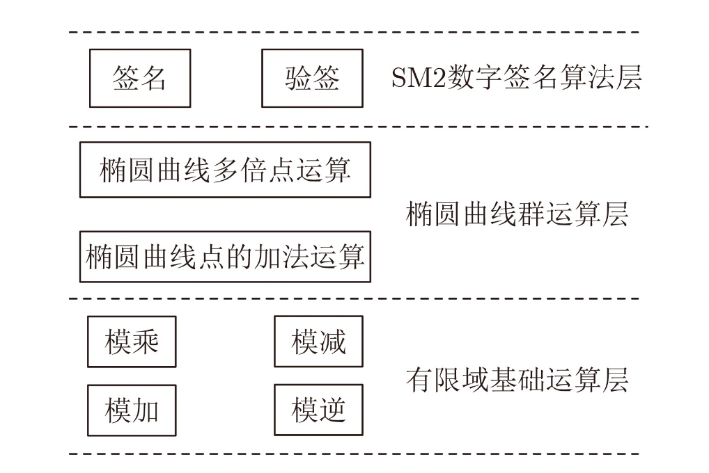
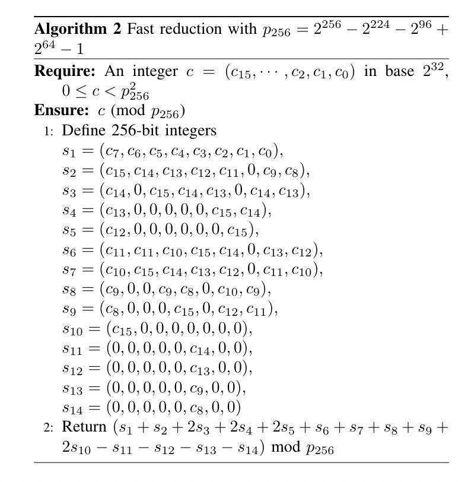
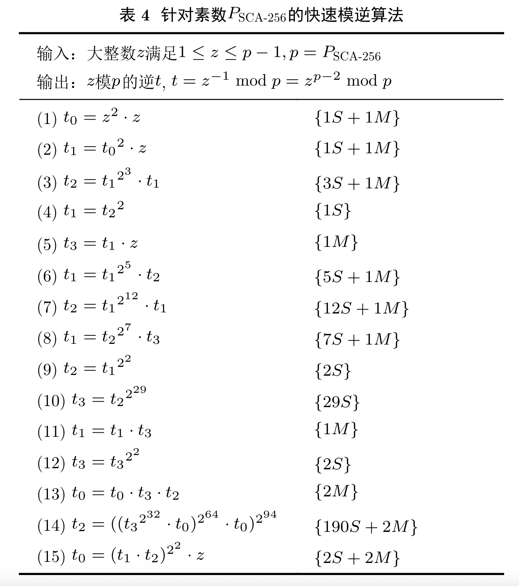
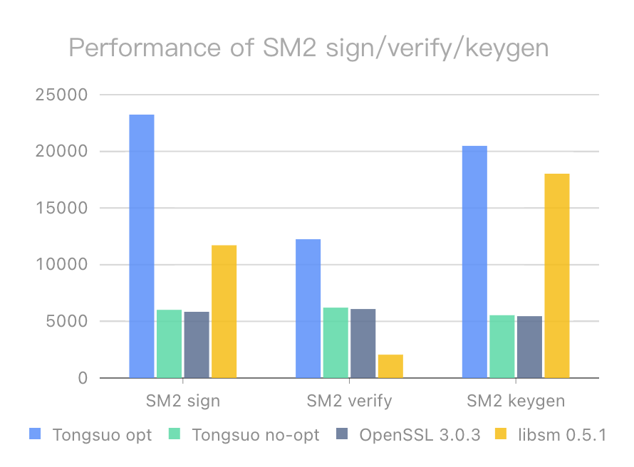

# 铜锁SM2算法性能优化实践：（一）综述

## 背景
椭圆曲线公钥密码算法（Elliptic Curve Cryptography，ECC）是一种基于椭圆曲线离散对数难题的非对称加密算法，广泛运用于数字签名、密钥交换、加密通信、证书签发等场景。国家密码管理局于2010年12月17日发布了国产自主可控的椭圆曲线公钥密码算法——SM2算法，有力保障了我国重要经济系统密码应用安全和行业信息系统安全。经过十几年的发展，SM2算法的应用场景不断深入拓展，形成了良好的国密生态，OpenSSL、Linux内核等业内知名开源项目已经接纳了SM2算法并运用于实际生产环境中。
随着信息技术的不断发展和区块链、Web 3.0等新兴产业的崛起，业界对于SM2算法的性能要求日益提高，特别是与加密通信、证书签发验证、区块链区块构造等直接相关的SM2数字签名算法，其性能表现对应用的整体性能有很大影响。遗憾的是，以OpenSSL为代表的密码学工具对SM2算法的性能优化进展缓慢，不利于SM2算法应用场景的进一步拓展。以OpenSSL 3.0.3版本为例，在Apple M2 pro芯片上运行SM2算法，其签名和验签性能约为6000次/秒，在高负载场景下将成为系统的性能瓶颈。
作为全球首个通过商用密码产品认证的国产密码学开源项目，铜锁相应地开展了SM2算法性能优化的探索研究。受OpenSSL中针对部分常用曲线实现特化算法的启发，借鉴NIST曲线在64位平台上的抗侧信道攻击工作，铜锁基于SM2曲线和GM/T 0003.5-2012给定的推荐参数， 在保证抗侧信道攻击安全性的前提下，实现了兼容大部分64位架构和常见编译器的64位平台性能优化，辅以SM2曲线参数特化的快速模约减、模逆元算法进一步提高性能。测试结果表明，在不同的测试工具和测试场景下，**开启了64位平台优化的SM2数字签名算法，其签名性能较基线版本提高约241%-286%，验签性能提高约74%-97%，密钥对生成性能提高269%，峰值性能分别可达约2.3万次/秒、约1.2万次/秒和约2.05万次/秒。**

## 优化技术路线分析与设计

作为椭圆曲线非对称加密算法的一类，SM2算法在计算数字签名时所执行的操作与其他椭圆曲线类似，主要涉及有限域运算、椭圆曲线运算和数字签名运算三大类计算操作，三类操作之间自底向上形成层级调用关系。经过抽象算法结构和筛选主要运算后，我们绘制出如图1所示的核心运算层次图：


图1：SM2数字签名算法核心运算层次图

若要着手实现SM2性能优化，其关键在于如何提升图1所示的核心运算的计算效率。由于数字签名的具体步骤由国密标准定义，可优化的潜力不大，因此我们首先分析了铜锁中与SM2相关的椭圆曲线和有限域运算源码。在铜锁中，与上述运算相关的各类函数以函数指针的形式封装在`EC_method`结构体中，根据曲线和优化方式不同，函数指针指向的具体函数也有差异。SM2与大多数曲线类似，采用通用的基于**蒙哥马利模乘法**优化素数域运算的方式，相关函数封装在结构体`mont_method`中。
蒙哥马利模乘法显著提升了各类曲线的性能，但由于现有代码中给出的是通用实现，故而仍有可挖掘的性能优化空间。事实上，OpenSSL针对部分使用频率高、应用范围广的椭圆曲线（nistp224、nistp256、nistp521曲线），在64位平台上相应实现了优化功能，取得了很好的优化效果（根据曲线不同，大约有50%-200%的性能提升）。推而广之，可以认为SM2曲线也存在类似的优化潜力。在充分阅读NIST曲线优化源码和SM2现有代码后，我们汇总了一些有较大潜力的性能优化点，自顶向下分别是：

1. **采用预计算优化椭圆曲线多倍点运算。** 多倍点运算可以分为两类：基于固定基点 $G$ 的基点乘法运算和基于任意曲线点 $P$ 的点乘运算，其本质都是一个256位大整数 $k$ 与椭圆曲线点做标量乘法的过程。
   1. 针对**点乘运算**，可以预计算小整数（例如0，1，2，……）与点 $P$ 做点乘的结果，然后将大整数 $k$ 划分为等长的 $n$ 段数，每一段数的值都落在预计算结果内，再通过移位和点加法运算组合得到最终运算结果。
   2. 针对**基点乘运算**，由于椭圆曲线点 $G$ 是固定不变的，因此我们可以扩大预计算的规模，并将预计算结果以预计算表的形式写入到源代码中，在运算时查表即可获得预计算值，以获得更好的性能提升效果。（事实上，这也是最后签名计算的性能提升水平显著高于验签计算的主要原因。）
2. **实现SM2曲线参数特化的快速模约减、模逆元算法。** 模约减是有限域运算中将运算中间值约化到有限域内的过程，在运算中出现频率极高，而模逆元则是有限域运算中耗时最大的运算。在GM/T 0003.5-2012给定的SM2曲线推荐参数中，素数 $p$ 为广义梅森素数，表示为 $p_{sm2p256} = 2^{256} − 2^{224} - 2^{96} + 2^{64} - 1$ 。利用广义梅森素数的性质，可以实现针对 $p_{sm2p256}$ 特化的快速模约减、模逆元算法，从而提高模约减和模逆元的速度。
3. **运用128位整数类型优化底层数据结构。** 有限域运算的参与对象都是256位的大整数，超过了所有整数类型的上限。在铜锁中，代表大整数的结构体`BIGNUM`在64位平台上使用4个64位无符号整数作为数据单元。这样带来的一个问题是不同数据单元运算时的进位借位非常复杂，在乘法/平方计算时还需要处理整形溢出的问题。如果将底层数据结构替换为4个128位无符号整数，在运算时使用128位整数的高64位“暂存”运算时产生的进位与借位，直至所有运算完成后再将“暂存”的结果规约到高位数据单元，不仅大大简化了计算实现过程，也能够提升有限域运算的效率。

在着手优化前，另一个必须重视的性质是优化代码的**抗侧信道攻击性**。侧信道攻击基于从密码系统的物理实现（例如：时间信息）中获取的信息对密码进行攻击与破译。在前述性能优化的具体实现过程中，存在以下两个可能的信息泄漏点：

   - **分支：** 代码中不同分支的执行时间不同，可能会造成时间信息的泄漏。即使精心设计了相同的分支执行时间，现代CPU的分支预测也可能使实际执行时间存在差异。域运算的进位、借位和溢出处理以及点乘运算时存在前导0等情况都可能产生分支。
   - **查表：** 由于现代CPU的多级存储结构，在一张表中查询数据时，对同一个数据项中进行多次查找的速度往往比查找多个数据项要快，这也会产生时间信息泄漏。基点乘法过程中的查表过程就存在这个问题。

我们主要参考了OpenSSL中NIST曲线在64位平台上的抗侧信道攻击工作的源码和[论文](http://link.springer.com/10.1007/978-3-642-29889-9_4)，在技术选型、代码实现的过程中不断强化代码的抗侧信道攻击性，**以尽可能小的性能代价换取恒定时间的函数实现，** 尽最大努力避免时间信息的泄漏。

## 关键技术实现

> 本章主要介绍优化功能的关键节点实现。受篇幅所限，快速模约减、模逆元函数的技术选型、算法推导的细节无法在本文中展现，后续会单独撰文详细介绍。

### 64-bit 平台优化
本节主要介绍第二章中归纳得出的性能优化点**1、3**的具体实现过程。参照自底向上的规则，我们首先介绍使用128位整数类型优化后的底层数据结构：
```c
#define NLIMBS 4

typedef uint128_t limb;
typedef limb felem[NLIMBS];
typedef limb longfelem[NLIMBS * 2];
typedef u64 smallfelem[NLIMBS];
```
这里称一个128位无符号整数构成的数据单元为`limb`。基于`limb`，我们可以构造两类保存大整数的数据结构`felem`和`longfelem`。`felem`负责表示在有限域内的大整数，而`longfelem`承担储存运算中间值（例如，因未约化而超出`felem`表示范围的模平方、模乘值）的角色。二者与大整数真实值的对应关系如下：

`felem`： $(v[0]*2^0 + v[1]*2^{64} + v[2]*2^{128} + v[3]*2^{192})  \mod p$

`longfelem`： $(v[0]*2^0 + v[1]*2^{64} + v[2]*2^{128} + ... + v[7]*2^{448})  \mod p$

换句话说，大整数以64bit为分割单元，自低到高填入`felem`和`longfelem`结构体中。可以注意到，对于`felem`和`longfelem`中的每一个`limb`，其高64位是空置的，因此我们不妨将当前`limb`的高64位与下一个`limb`的低64位“重叠”，由高64位“暂存”在有限域运算中产生的进位或借位，直到所有运算结束后再约化到下一个`limb`上，最终得到由4个u64组成的`smallfelem`。
在底层数据结构之上，我们需要实现有限域的基础运算。这里我们主要参考了nistp256的有限域运算源码，根据SM2曲线参数的特性调整了部分功能实现。在第2章中我们提到，**有限域运算时因处理进位、借位和溢出时可能因代码分支而产生侧信道攻击问题。** 进位借位问题经由前述`limb`高64位“暂存”的方式可以解决，但在执行模减法等运算时，若被减数小于减数，则会产生“下溢”现象，处理负值时同样会产生分支。对此，我们利用模运算的性质，在做减法前在为被减数加上一个素数 $p$ 的倍数 $k *p$ ，在保证被减数始终大于减数的同时，也由于 $(k*p) \mod p = 0$ ，因此不会对最终运算结果产生影响。以下述代码为例：
```c
static void felem_diff(felem out, const felem in)
{
    /*
     * In order to prevent underflow, we add 0 mod p before subtracting.
     */
    out[0] += zero105[0];
    out[1] += zero105[1];
    out[2] += zero105[2];
    out[3] += zero105[3];

    out[0] -= in[0];
    out[1] -= in[1];
    out[2] -= in[2];
    out[3] -= in[3];
}
```
`zero105`是一个常数，其值等于 $2^{41} * p$ 。在做减法前，先计算 $out[i] += zero105[i]$ ，使`out[i]` 满足 $out[i]>2^{105}$ 。我们可以构造不同的常数`zero*`，以满足输入大小不同的情况。
接下来的椭圆曲线群加法部分，由于sm2曲线曲线与nistp256曲线均满足 $a = p -3$ ，故而此处我们选用了与nistp256一致的算法，该算法由著名密码学家Bernstein于2007年提出，需调用11次有限域乘法和5次有限域平方完成加法运算，是SM2曲线当下最优的点加法实现，一般记作 [add-2007-b](http://hyperelliptic.org/EFD/g1p/auto-shortw-jacobian-3.html#addition-add-2007-bl) 算法。
到了椭圆曲线多倍点运算环节，我们采用第二章中的思路分别实现相应的点乘法和基点乘法。先前已有讨论，此环节同样具有泄漏时间信息的可能。对此，[论文](http://link.springer.com/10.1007/978-3-642-29889-9_4)中给出了如下思路：

   - 对于点乘法，对于非必要的运算操作（例如与0相乘）依然执行计算，计算时与无穷远点相乘。
   - 对于预计算查表过程，使用来自硬件查找表的技术来设计软件解决方案，实现 select_point 函数，按照固定的顺序循环遍整个预计算表后获得所需的预计算项。虽然**执行时间仍与缓存相关**，但该方法将时间与查找索引解耦，不会泄露有价值的时间信息：
```c
/*
 * select_point selects the |idx|th point from a precomputation table and
 * copies it to out.
 */
static void select_point(const u64 idx, unsigned int size,
                         const smallfelem pre_comp[16][3], smallfelem out[3])
{
    unsigned i, j;
    u64 *outlimbs = &out[0][0];

    memset(out, 0, sizeof(*out) * 3);

    for (i = 0; i < size; i++) {
        const u64 *inlimbs = (u64 *)&pre_comp[i][0][0];
        u64 mask = i ^ idx;
        mask |= mask >> 4;
        mask |= mask >> 2;
        mask |= mask >> 1;
        mask &= 1;
        mask--;
        for (j = 0; j < NLIMBS * 3; j++)
            outlimbs[j] |= inlimbs[j] & mask;
    }
}
```
最后我们还需要将优化代码嵌入到现有架构中。首先我们构造结构体`EC_GFp_sm2p256_method`，将本次优化中实现的与多倍点运算相关的三个函数嵌入结构体中：
```c
const EC_METHOD *EC_GFp_sm2p256_method(void)
{
    static const EC_METHOD ret = {
        /*此处省略部分函数*/
        ossl_ec_GFp_sm2p256_points_mul,
        ossl_ec_GFp_sm2p256_precompute_mult,
        ossl_ec_GFp_sm2p256_have_precompute_mult,
        /*此处省略部分函数*/
    };

    return &ret;
}
```
相应地，还需要把预计算表`SM2P256_PRE_COMP`嵌入到现有代码中专门存储预计算表的联合体中：
```c
    union {
        NISTP224_PRE_COMP *nistp224;
        NISTP256_PRE_COMP *nistp256;
        NISTP521_PRE_COMP *nistp521;
        NISTZ256_PRE_COMP *nistz256;
        SM2P256_PRE_COMP *sm2p256;
        EC_PRE_COMP *ec;
    } pre_comp;
```
最后，将完整的`EC_GFp_sm2p256_method`以条件编译的形式加入椭圆曲线参数列表：
```c
# ifndef OPENSSL_NO_SM2
    {NID_sm2, &_EC_sm2p256v1.h,
# if !defined(OPENSSL_NO_EC_SM2P_64_GCC_128)
     EC_GFp_sm2p256_method,
# else
     0,
# endif
     "SM2 curve over a 256 bit prime field"},
# endif
```

### 快速模约减算法实现

在有限域运算中，对于运算结果大于 $p$ 的中间值，需要将其约减到 $p$ 以内，此过程也被称为模约减。由于 $p$ 是一个非常大的256位素数，且运算中间值最大可达 $p^2-1$ ，采用除法来计算模约减的效率将极其低下（在具体实践中，有限域除法一般借助乘法逆元实现，其耗时大约是模乘的200-300倍）。
目前，铜锁中的SM2算法调用的是通用的模约减优化函数，暂时没有针对曲线特化的快速模约减算法实现。第2章中已有提及，SM2曲线的推荐参数 $p$ 属于广义梅森素数， 而广义梅森素数在公钥密码学广泛运用的一个重要原因就是，基于此类素数可以实现快速模约减算法。具体来说，该算法能够将对 $p$ 的有限域除法转化为少量的加减法运算和位移操作，从而提升模约减的速度。我们参照如图2所示的算法实现了基于SM2曲线参数的快速模约减算法：


图2：基于SM2曲线参数的快速模约减算法

### 快速模逆元算法实现

在有限域模运算中，乘法逆元（模逆元）的定义如下：如果 $a$ 和 $m$ 是正整数且满足 $gcd(a,m)=1$ ，那么在模 $m$ 意义下，存在一个整数 $b$ ，使得 $ab \equiv 1 \pmod{m}$ ，此时 $b$ 就是 $a$ 在模运算下的逆元，记作 $a^{-1}$ 。在sm2数字签名算法中，存在两个必须计算模逆元的步骤：一是将椭圆曲线公钥点 $P_K$ 由仿射坐标转化为雅可比坐标时需要计算 $z$ 轴坐标 $z_1$ 对素数 $p$ 的模逆元，二是在签名计算过程中求解私钥 $d_A + 1$ 对椭圆曲线阶数 $n$ 的模逆元。
由于模逆元的计算复杂，且模逆元运算是有限域中开销最大的运算， 因此成为制约SM2算法运行效率的瓶颈之一。目前，铜锁项目中尚未针对sm2曲线实现参数特化的快速模逆元算法，存在可以进一步优化提升的空间。一般来说，可以使用拓展欧几里得优化算法和基于费马小定理的算法实现快速模逆元。经过综合分析与比选后，我们选择了性能稍劣但实现简单且容易设计恒定时间算法的费马小定理优化。此时，若要计算 $a^{-1}$ ，只需计算：

$a^{p-2} = a^{2^{256} − 2^{224} - 2^{96} + 2^{64} - 3} \pmod{p}$

优化后的模逆元虽可以分解为模乘法和模平方运算，但由于指数 $p-2$ 非常大，常规方式求解的效率依然很低。这里我们借用加法链的思想，将幂计算分解为多个小幂相乘的形式，从而减少幂运算的时间复杂度。目前，针对sm2曲线参数 $p$ 的模逆元加法链研究中，一个较优解是朱辉等人提出的[方案](https://jeit.ac.cn/cn/article/doi/10.11999/JEIT211049)，此方案复杂度为255次模平方+14次模乘法，需要4个变量作为中间值，具体如下：


图3：基于SM2曲线参数的快速模逆元算法

## 优化功能启用及系统要求

SM2算法64位平台性能优化功能的实现全面兼容铜锁现有架构，不涉及对已有API参数或返回值的改变，用户在使用时无需显式调用优化代码，只需要在配置阶段开启优化参数`enable-ec_sm2p_64_gcc_128` 即可：
```bash
./config --prefix=/opt/tongsuo -Wl,-rpath,/opt/tongsuo/lib enable-ec_sm2p_64_gcc_128
```
本功能的实现以算法优化和数据结构优化为主，代码主体暂不涉及汇编层面的优化，因此在64位平台上有较好的优化通用性。由于数据结构优化与字节序和大整数类型相关，因此用户在配置优化参数前需确认当前平台满足以下三个要求：
> 1. CPU为64位架构，支持64位寄存器
> 2. 系统字节序为小端序（绝大多数CPU架构，例如x86-64 、aarch64、MIPS64等架构均采用小端字节序）
> 3. 编译器支持`uint128_t` 和`int128_t`整数类型。以下是一些常见编译器支持128位整数类型的最低版本：
>    1. gcc：最低版本4.1（2006年发布），推荐使用4.6及更高版本
>    2. clang：最低版本3.0（2011年发布），推荐使用3.1及更高版本
>    3. Intel C++ Compiler（ICC，2013年发布)：最低版本13，推荐使用16及更高版本
> 
*注：截止目前（2023年7月），MSVC编译器仍未原生支持128 位整数类型，可以使用第三方库实现对上述类型的支持

上述要求似乎有些复杂，但考虑到**64位设备日益普及，以及大部分CPU架构为小端序，主流编译器已经支持128位整数类型多年**的现状，可以认为大多数64位平台用户都可以使用本功能并从中获取性能增益。

## 性能测试

首先给出性能测试环境的相关参数：

| 操作系统版本 | macOS Ventura 13.2.1 |
| --- | --- |
| CPU | Apple M2 pro |
| 内存 | 16 GB 6400 MHz LPDDR5 |
| 硬盘 | 512G SSD |

为了更全面地展现本优化功能的性能表现，我们使用铜锁自主开发的测试程序和Openssl自带的speed命令测试SM2算法的签名、验签和密钥对生成（仅测试二）的速度。
使用Openssl自带的speed命令时，为了便于对比，我们分别测试打开优化命令`enable-ec_sm2p_64_gcc_128`和未打开优化命令下的铜锁master版本，以及OpenSSL 3.0.3版本的性能数据，并以未打开优化命令下的铜锁master版本的性能作为测试基线。测试结果如下所示：

|  | Tongsuo optimization | Tongsuo no-opt | OpenSSL 3.0.3 | Improvement |
| --- | --- | --- | --- | --- |
| SM2 sign | 20384.8 /s | 5966.9/s | 5848.4/s | **+241.6%** |
| SM2 verify | 10946.2/s | 6276.8/s | 6137.5/s | **+74.4%** |


使用铜锁自主开发的性能测试程序时，我们设定测试数据为大小1MB的随机数据，同样测试打开/不打开优化命令的铜锁master版本，以及OpenSSL 3.0.3版本的性能数据。为了增加对比，我们同时测试了Rust社区开源国密算法库libsm的性能。测试基线与前文一致：

|  | Tongsuo optimization | Tongsuo no-opt | OpenSSL 3.0.3 | libsm 0.5.1 | Improvement |
| --- | --- | --- | --- | --- | --- |
| SM2 sign | 23242/s | 6017/s | 5842/s | 11713/s | **+286.2%** |
| SM2 verify | 12246/s | 6212/s | 6088/s | 2061/s | **+97.1%** |
| SM2 keygen | 20485/s | 5543/s | 5457/s | 16028/s | **+269.5%** |


性能测试结果表明，铜锁中针对SM2算法实现的64-bit 平台优化取得了较大的性能提升效果，符合优化工作的预期目标。从优化结果来看，签名算法和密钥对生成过程的优化提升明显高于验签算法，这主要是因为签名算法和密钥对生成过程所涉及的的椭圆曲线多倍点运算是基点乘运算，可以使用预置的预计算表加速计算，而验签算法的椭圆曲线多倍点运算是普通点乘运算，曲线点是不固定的，因而无法利用预计算表实现性能的进一步突破。

## 参考文献

1. 《Fast Elliptic Curve Cryptography in OpenSSL》
2. 《Efficient and Secure Elliptic Curve Cryptography Implementation of Curve P-256》
3. 《Ultra High-Speed SM2 ASIC Implementation》
4. 《Fast Prime Field Elliptic Curve Cryptography with 256 Bit Primes》
5. 《一种基于图形处理器的高吞吐量SM2数字签名计算方案》
